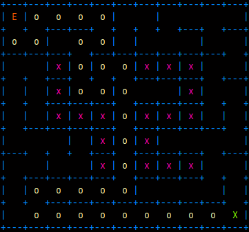
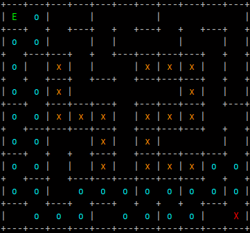
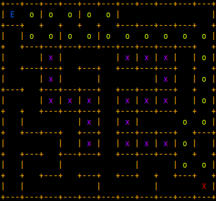

<div align="center">

# A-Maze-ing

</div>

<div align="center">


</div>

<p align="center">
  
  
  
</p>

*Why not MLX? Because I'm too lazy to learn it, so why not ASCII instead? XD*

## Description

A-Maze-ing is a maze generator and visualizer written in Python. The program reads a configuration file, generates a maze using a randomized Depth-First Search (recursive backtracker) algorithm, writes the result to an output file using a hexadecimal wall encoding, and displays the maze in the terminal using ASCII rendering.

The project is split into reusable components:
- `mazegen` : the core maze generation library
- `maze_display` : the ASCII rendering module
- `parsing` : configuration file parsing and validation
- `a_maze_ing.py` : the main entry point tying everything together

## Instructions

### Requirements

- Python 3.10+
- Dependencies listed in `requirements.txt`

### Setup

```
make setup
source maze/bin/activate
```

### Run

```
make run
```

This runs `python3 a_maze_ing.py config.txt`.

You can also run it manually with a custom config file:

```
python3 a_maze_ing.py my_config.txt
```

### Debug

```
make debug
```

### Lint

```
make lint
make lint-strict
```

### Clean

```
make clean
```

### Build the reusable package

```
make build
```

This generates the `mazegen-*.whl` / `mazegen-*.tar.gz` package at the root of the repository, ready to be installed with `pip install mazegen-1.0.0-py3-none-any.whl`.

## Configuration file format

The configuration file is a plain text file containing one `KEY=VALUE` pair per line. Lines starting with `#` are comments and are ignored.

| Key | Description | Example |
| --- | --- | --- |
| WIDTH | Maze width (number of cells) | WIDTH=15 |
| HEIGHT | Maze height (number of cells) | HEIGHT=15 |
| ENTRY | Entry coordinates (x,y) | ENTRY=0,0 |
| EXIT | Exit coordinates (x,y) | EXIT=14,14 |
| OUTPUT_FILE | Output filename (must end in .txt) | OUTPUT_FILE=output.txt |
| PERFECT | Whether the maze has a unique path (True/False) | PERFECT=True |
| SEED | Seed for reproducibility, or "None" for random | SEED=None |
| DISPLAY_SOLUTION | Whether to display the solution path | DISPLAY_SOLUTION=True |

Example `config.txt`:

```
WIDTH=15
HEIGHT=15
ENTRY=0,0
EXIT=14,14
OUTPUT_FILE=output.txt
PERFECT=True
SEED=None
DISPLAY_SOLUTION=True
```

## Maze generation algorithm

The maze is generated using **randomized Depth-First Search (recursive backtracker)**.

### Why this algorithm

- It is simple to implement iteratively (using a stack), avoiding recursion-depth issues on large mazes.
- It naturally produces **perfect mazes**: exactly one path between any two cells, since every wall removal connects a new unvisited cell to the tree.
- It tends to generate long, winding corridors, which gives visually interesting mazes compared to algorithms like Prim's (which tend to produce more uniform, "blobby" mazes).
- It is easy to extend: for imperfect mazes, extra walls can simply be removed afterward (loops added) while checking that no 3x3 open area is created, and a solver (BFS) can be reused independently of the generation.

## Code reusability

The `mazegen` package is fully reusable and installable via pip:

- `mazegen.Grid` : low-level grid/wall representation (bitmask per cell)
- `mazegen.MazeGenerator` : abstract base class defining the maze interface (logo placement, hexadecimal export, cardinal path conversion, file output)
- `mazegen.DepthFirstSearch` : concrete generator implementing `generate()` and `solver()`

### Basic usage

```python
from mazegen import DepthFirstSearch

maze = DepthFirstSearch(
    width=15,
    height=15,
    entry=(0, 0),
    exit=(14, 14),
    perfect=True,
    seed=42,
)

maze.generate()

# Access the solution path
path = maze.solver()

# Access the raw grid structure
print(maze.grid.cells)

# Export to hexadecimal representation
hexa_maze = maze.create_hexa_maze()
```

### Custom parameters

- `width`, `height` : dimensions of the maze
- `entry`, `exit` : tuples of (x, y) coordinates
- `perfect` : if `False`, additional walls are removed to create loops (while respecting the no-3x3-open-area constraint)
- `seed` : integer seed for reproducible generation

## Resources

- [Maze generation algorithms - Wikipedia](https://en.wikipedia.org/wiki/Maze_generation_algorithm)
- [Think Labyrinth: Maze algorithms](https://www.astrolog.org/labyrnth/algrithm.htm)
- [ANSI escape codes reference](https://en.wikipedia.org/wiki/ANSI_escape_code)
- [Pydantic documentation](https://docs.pydantic.dev/)
- [Python typing module documentation](https://docs.python.org/3/library/typing.html)

